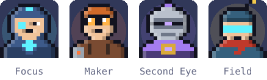
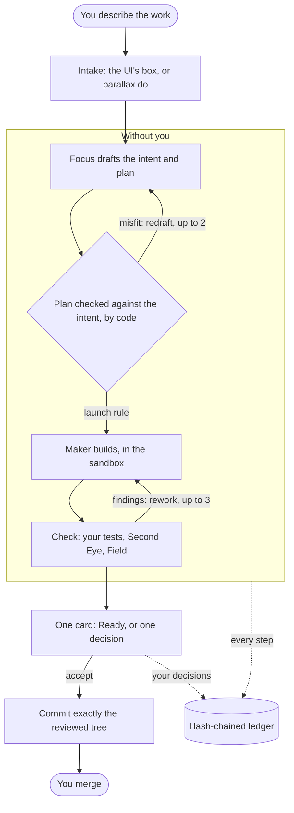
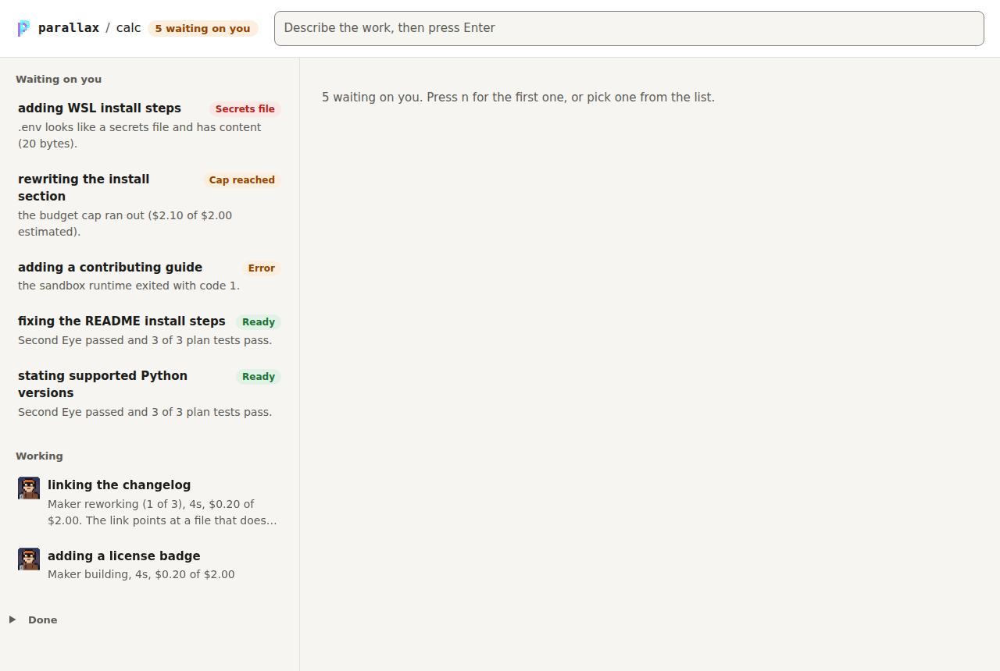
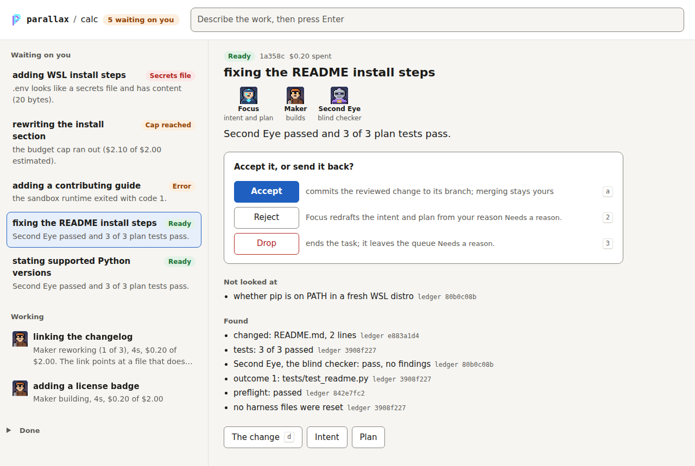

<p align="center"></p>

# Parallax

[](https://github.com/mpwilso/parallax/actions/workflows/tests.yml)

**Agents do the work. You make the calls.**
**The rules are the baseline. Nothing gets measured without them.**

A local tool that runs Claude Code agents on your repo inside a sandbox, checks their work, and brings you one decision per task. You describe the work in plain words; Focus drafts the intent and plan, Maker builds it in a sandbox, your tests run, Second Eye reviews the result blind, Field tries the UI, and it comes back as one card. Merging is always yours.

## What's distinctive

- **One human touch per normal task is the goal, and it's measured.** `parallax stats` counts touches per task; a task that needs nothing from you until Ready takes one, the accept.
- **Every question is one decision.** The question, the options, what each does, whose call it is and why a human, with a recommendation written by code, never by a model.
- **The boundary is part of the approval.** What a task may cross (network domains, reads outside its worktree, new dependencies) is in the plan that gets signed, and both sandbox layers are tested before every launch. A plan that opens the boundary never launches without you.
- **A checker that never sees the making.** Second Eye gets only the intended outcome, the rules in `REVIEW.md` and the diff, never the plan or Maker's notes, on the first review and every re-review. That input is pinned by a test.
- **Code routes, models return text.** Which agent runs next, and on what, is decided by code. Every step is on an append-only, hash-chained ledger, and every approval is signed with a key the sandbox can't read.

## The agents



**Focus** drafts the intent and plan. **Maker** builds in the sandbox. **Second Eye** is the blind checker: it sees only the result, never the making. **Field** is the UI tester, which uses your app in a real browser and leaves tests behind. In the UI a portrait moves only while its agent is working on that task; everything else is still.

## Many ways in, one way through

Work comes in from the UI's box or `parallax do`; a task is resumed by `parallax decide`, `approve`, `build` or `recheck`, or by a rework. Every one of those ends in the same code: a signed approval, the budget cap, a preflight of both sandbox layers, and a ledger entry, before any agent starts. One test drives every entry point and checks that.



| What waits on you | A card |
|---|---|
|  |  |

## Day to day

**Start it.** In your repo, `parallax ui` and open the link it prints (the link stays the same between runs). **Type work in** the box and press Enter; that's all. **Read the list:** Waiting on you is the only part that needs you, riskiest first; Working shows which agent has each task, for how long and what it has spent; Done is folded away. **Open a card** (click it, or `n` for the next one that waits): the stages, the bottom line, the one question with its options and which one is recommended, what nobody looked at, and the evidence, with the change, intent and plan one click away.

**Ready** means the listed checks passed: the plan's tests ran on the exact reviewed tree, the card says for each outcome in the intent which test that ran covers it or that none does, and Second Eye found nothing blocking. It does not mean the code is bug-free. Accept commits the reviewed change to the task's branch and shows the merge command, which you run yourself. **Needs you** means one decision only you can make; the card says whose call it is and why a human. Anything that sends work back, drops it or accepts a risk asks for a one-line reason, and Focus redrafts from it.

**Keys:** `/` type work, `n` next waiting, `j`/`k` move, `a` then `Enter` accept, `r` reject, `1` to `9` then `Enter` pick an option, `d` the change, `Esc` back. The terminal has the same: `parallax do`, `inbox`, `show <task>`, `accept <task>`, `reject <task> --reason "..."`, `decide <task> <option>`, `stats`.

## Status and known limits

A working prototype I use on this repo. One task it did on itself, from the typed request to the accepted commit: [docs/example.md](docs/example.md). Three real runs through the UI with every state and cost: [docs/ui-runs/](docs/ui-runs/README.md). How it got here: [docs/history.md](docs/history.md). What it protects and what it can't: [docs/THREAT_MODEL.md](docs/THREAT_MODEL.md).

- **Second Eye reads the diff and can't run code.** It judges the outcome where the diff shows it, and says what it couldn't see. Proving that tests actually catch failures (a test seen failing before the fix, or a mutation the tests catch) is planned work, not done.
- **Linux or WSL2.** It needs Claude Code's sandbox (bubblewrap); that sandbox doesn't run on native Windows. macOS is untested.
- **It needs Claude Code**, logged in, and the Claude Agent SDK. Costs are Claude Code's estimates at list prices; on a subscription your real limit is the plan's usage limits, which Parallax can't see.
- **A cap can overshoot by one turn.** Every agent gets what's left of the cap as its own limit, but the SDK checks it between turns.
- **Field's browser server is pinned** to `@playwright/mcp` 0.0.70: later versions need Unix sockets the sandbox refuses.
- **The three real-sandbox tests need a machine that allows unprivileged user namespaces**; elsewhere they skip and say why.
- **One person, one machine.** No splitting work into several tasks yet, and no evals on the current pipeline yet (both planned).

## How it was built

I designed Parallax and directed its build; Claude Code wrote most of the code under that direction. I reviewed every milestone, and the design notes and real run logs in [docs/](docs/) show the process.

## What's next

- Evals on the current pipeline, scored by real merged fixes.
- A behavioral verifier: tests of the intended outcomes, written before the build, that Maker can't change.
- Several parallel tasks from one request.
- A knowledge layer that gives agents project context and past decisions to draw on.

## Setup

Linux, or Windows through WSL2. On Windows, make the distro first: [docs/wsl.md](docs/wsl.md), then continue here inside it. macOS is untested.

1. The tools, as root. Apt's Node is too old for the sandbox runtime, so Node comes from NodeSource:
   ```bash
   apt update && apt install -y git bubblewrap socat ripgrep python3 curl ca-certificates
   curl -fsSL https://deb.nodesource.com/setup_22.x | bash - && apt install -y nodejs
   npm install -g @anthropic-ai/sandbox-runtime
   ```
   On Ubuntu 24.04 and later, allow the user namespaces the sandbox needs (CI does the same): `sysctl -w kernel.apparmor_restrict_unprivileged_userns=0`, and put that line in `/etc/sysctl.d/99-parallax.conf` so it survives a reboot.
2. As your user, uv and Claude Code, then log in:
   ```bash
   curl -LsSf https://astral.sh/uv/install.sh | sh
   curl -fsSL https://claude.ai/install.sh | bash
   source ~/.local/bin/env && claude
   ```
3. Parallax itself:
   ```bash
   git clone https://github.com/mpwilso/parallax ~/code/parallax
   uv tool install --editable "$HOME/code/parallax[claude]"
   ```
4. Check the machine:
   ```bash
   parallax doctor
   ```
   ```
   platform      linux on wsl2                      ok
   sandbox       bubblewrap, socat, srt             ok
   claude login  found                              ok
   windows       interop off, path off, drives off  ok
   approval key  ~/.config/parallax/key             ok
   signing key   none: accept commits won't be signed
   ready.
   ```
5. In a git repo you want agents to work on: `parallax init`, then `parallax ui`. If the repo's tests need dependencies, set `[build] setup` in `parallax.policy.toml` to the command that makes a venv at `$PARALLAX_VENV`; `init` shows the command and asks first when the repo's example policy already has one.

**Stop and remove.** `Ctrl+C` in the terminal running `parallax ui` stops the page; `parallax stop` ends every running build now and records it. To remove Parallax: `uv tool uninstall parallax`, then delete `~/.local/share/parallax` (worktrees, task folders, Field's tools) and `~/.config/parallax` (the approval key and UI links). A repo keeps only `parallax.policy.toml`, `REVIEW.md`, its ledger in `.parallax/` and the `docs/tasks/` it accepted; delete those to leave no trace.

The tests never call a model: `uv run --python 3.12 --with pytest --with playwright --with-editable . python -m pytest -q`. The browser tests need `python -m playwright install --with-deps chromium` once.
