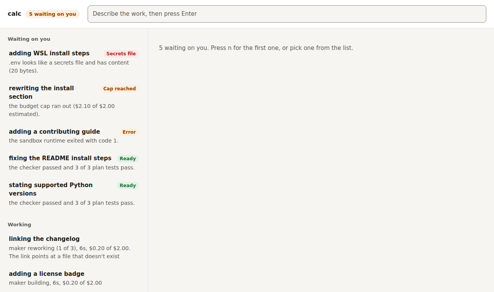
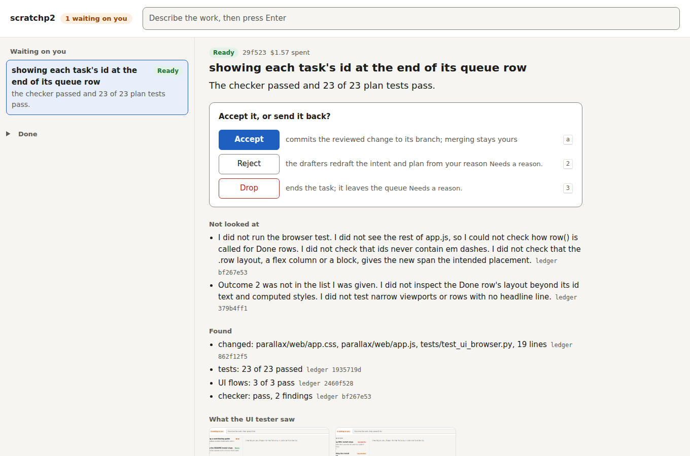
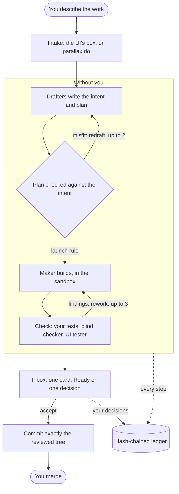

# Parallax

[](https://github.com/OWNER/parallax/actions/workflows/tests.yml)

**Parallax is hands-free: execution happens without you, and you only make the judgment calls, with everything you need to make them well.** You describe work in plain words; drafters plan it, a maker builds it in a sandbox, and your tests, a blind checker and an optional UI tester check it, all without you. It comes back as one card with one decision, every step is on a hash-chained ledger, and merging is always yours.

| What waits on you | A card |
|---|---|
|  |  |

## How it works



The maker never sees your key, your home folder or the network the plan doesn't name. The checker sees only the outcome, the constraints, `REVIEW.md` and the diff, never the maker's explanation. How it all fits: [docs/parallax.md](docs/parallax.md). What it does and doesn't protect: [docs/THREAT_MODEL.md](docs/THREAT_MODEL.md).

## How to use Parallax day to day

**Start it.** In your repo, run `parallax ui` and open the link it prints (from Windows, in your browser; WSL passes `localhost` through). The link stays the same between runs, so bookmark it. Leave the terminal open.

**Type work in.** Write what you want in the box at the top, in plain words, and press Enter. That's all. Drafters write the intent and plan, the maker builds it in a sandbox, tests run, and a blind checker reviews it, all without you.

**Read the list.** Three parts, most important first:
- **Waiting on you:** the only part that needs you. The riskiest item is on top.
- **Working:** one line per task saying which agent has it, for how long, and what it has spent of its cap. Nothing to do here.
- **Done:** folded away. An accepted task says when the merge is still yours.

**Open a card** (click it, or press `n` for the next one that waits). It reads top to bottom: the bottom line, the one question, your options with what each does and which one is recommended, then what nobody looked at, and the evidence. The change, the intent and the plan are one click away.
- **Ready** means tests pass and the checker found nothing blocking. Accept it, or reject it with a reason.
- **Needs you** means one decision only you can make: a change outside the plan, a secrets file, a reached cap, an error, or a UI test that still fails. The question says which.
- **A redraft** says so at the top, quotes your reason, and lists what changed since the version you rejected.

**Accept and merge.** Accept commits the reviewed change to the task's branch and shows the merge command. Run it yourself in your repo's folder: merging is always yours.

**When something needs you,** pick an option. Anything that sends work back, drops it, or accepts a risk asks for a one-line reason; the drafters use it. After you decide, the next card that waits opens on its own. If you'd rather not keep the task, drop it.

**Keys:** `/` type work, `n` next waiting, `j`/`k` move, `a` then `Enter` accept, `r` reject, `1` to `9` then `Enter` pick an option, `d` the change, `Esc` back. The same is in the terminal: `parallax do`, `parallax inbox`, `parallax show <task>`, `parallax accept <task>`, `parallax reject <task> --reason "..."`, `parallax decide <task> <option>`, `parallax stats`.

## Status and known limits

A working prototype I use on this repo: a task it did on itself, with its record, is in [docs/tasks/](docs/tasks/), and three real runs through the UI, with every state, cost and the bugs they found, are in [docs/ui-runs/](docs/ui-runs/README.md). How it got here: [docs/history.md](docs/history.md).

- **Linux or WSL2 only.** It needs Claude Code's sandbox (bubblewrap). Native Windows isn't supported; macOS is untested.
- **It needs Claude Code**, logged in, and the Claude Agent SDK. Costs are Claude Code's estimates at list prices; on a subscription your real limit is the plan's usage limits, which Parallax can't see.
- **A cap can overshoot by one turn.** Every agent gets what's left of the cap as its own limit, but the SDK checks it between turns.
- **The UI tester's browser server is pinned** to `@playwright/mcp` 0.0.70: later versions need Unix sockets the sandbox refuses.
- **One person, one machine.** No splitting work into several tasks or scheduling them yet, and no evals on the current pipeline yet (both planned).

## Setup

Windows users run Parallax inside WSL2, in a distro just for it. On Linux, start at step 3.

1. In PowerShell as admin: `wsl --install --no-distribution`, then restart. Then make a distro named `parallax`:
   ```powershell
   wsl --install Ubuntu-24.04 --no-launch
   wsl --export Ubuntu-24.04 $env:TEMP\u.tar
   wsl --import parallax C:\WSL\parallax $env:TEMP\u.tar --version 2
   wsl --unregister Ubuntu-24.04
   ```
2. `wsl -d parallax`, then as root: `adduser <you>` and `usermod -aG sudo <you>`.
3. As root, the tools. Apt's Node is too old for the sandbox runtime, so Node comes from NodeSource:
   ```bash
   apt update && apt install -y git bubblewrap socat ripgrep python3 curl ca-certificates
   curl -fsSL https://deb.nodesource.com/setup_22.x | bash - && apt install -y nodejs
   npm install -g @anthropic-ai/sandbox-runtime
   ```
4. As your user, uv and Claude Code, then log in:
   ```bash
   curl -LsSf https://astral.sh/uv/install.sh | sh
   curl -fsSL https://claude.ai/install.sh | bash
   source ~/.local/bin/env && claude
   ```
5. Parallax itself:
   ```bash
   git clone <this repo> ~/code/parallax
   uv tool install --editable "$HOME/code/parallax[claude]"
   ```
6. On WSL, harden the distro: interop and mounted Windows drives off. Write `/etc/wsl.conf` with `[user] default=<you>`, `[interop] enabled=false` and `appendWindowsPath=false`, and `[automount] enabled=false`, then `wsl --terminate parallax` from PowerShell.
7. Check the machine:
   ```bash
   parallax doctor
   ```
   ```
   platform      linux on wsl2                      ok
   sandbox       bubblewrap, socat, srt             ok
   claude login  found                              ok
   windows       interop off, path off, drives off  ok
   approval key  ~/.config/parallax/key             ok
   signing key   none: accept commits won't be signed
   ready.
   ```
8. In a git repo you want agents to work on: `parallax init`, then `parallax ui`.

The tests never call a model: `uv run --with pytest --with playwright --with-editable . python -m pytest -q`. The browser tests need `python -m playwright install --with-deps chromium` once.
