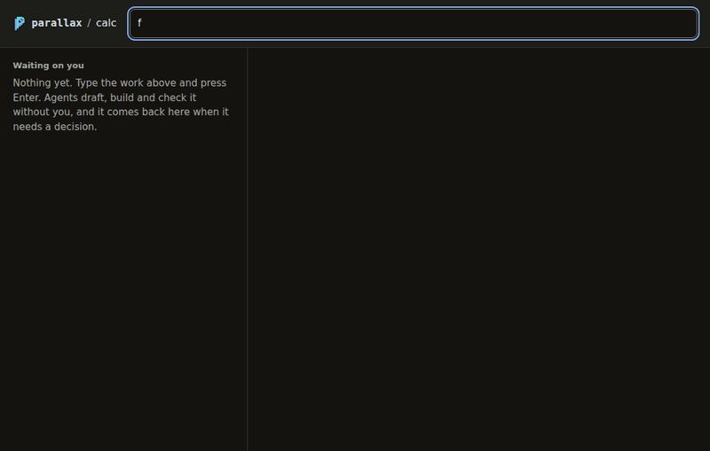
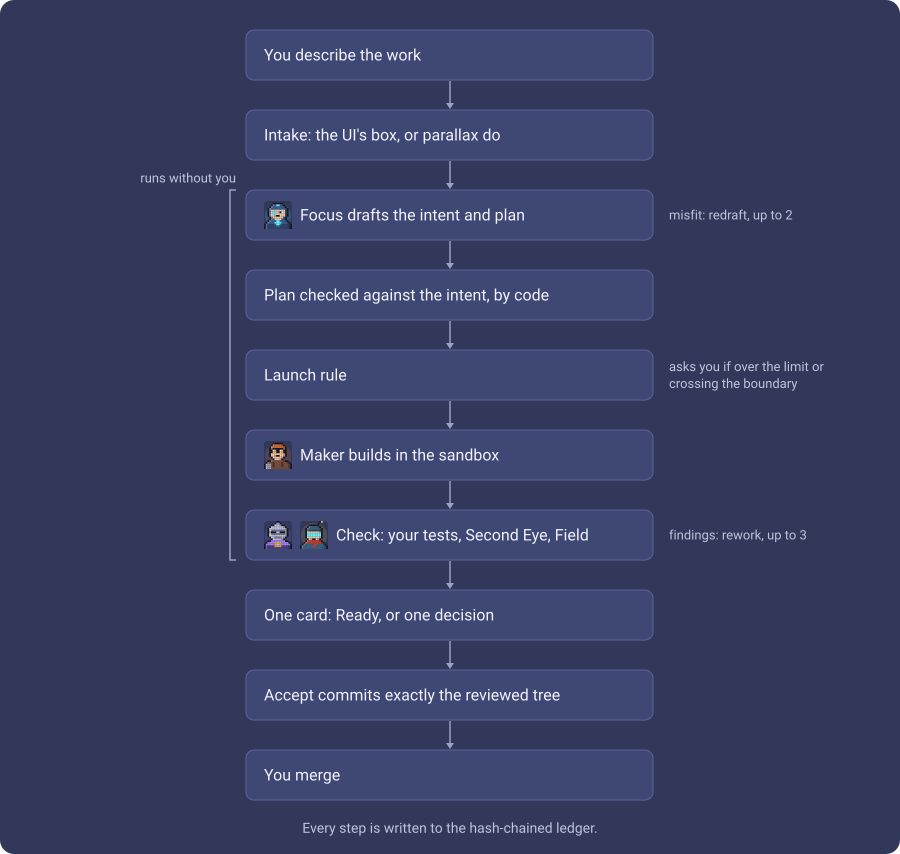
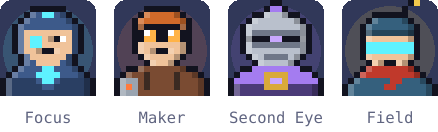

<p align="center">
  <picture>
    <source media="(prefers-color-scheme: dark)" srcset="docs/brand/lockup-animated-dark.svg">
    
  </picture>
</p>

[](https://github.com/mpwilso/parallax/actions/workflows/tests.yml)

**Agents do the work. You make the calls.**

Parallax is a local tool for developers who use AI coding agents. The agents plan, build and check the work on their own, inside a sandbox. Parallax checks what they produce and only comes to you when a person has to decide. For most tasks that's one decision: accept the result or send it back.

<p align="center"></p>

<p align="center"><sub>Demo with scripted agents, so it runs in seconds and costs nothing. Real runs are in <a href="docs/ui-runs/">docs/ui-runs/</a>.</sub></p>

| 3 min 25 s from request to Ready | $0.92 in agent costs (estimate) | 1 decision: accept |
|:---:|:---:|:---:|

A real task: a one-line README fix, run through the UI. All three real runs, with every screen and cost: [docs/ui-runs/](docs/ui-runs/README.md).

## Why it exists

AI can now write code faster than people can review it. The bottleneck has moved to judgment: what to build, what to trust, what to ship. Parallax runs the execution without you, and every question that reaches you comes with what you need to answer it.

## How a task moves

<p align="center"></p>

## The agents

<picture>
  <source media="(prefers-color-scheme: dark)" srcset="docs/brand/party-animated-dark.svg">
  
</picture>

**Focus** drafts the intent and plan. **Reticle** writes tests of what you asked, before the build; Maker can't see or change them. **Maker** builds in the sandbox. **Second Eye** is the blind checker: it sees only the result, never the making. **Field** is the UI tester, which uses your app in a real browser and leaves tests behind. Here they take turns the way a task moves through them; in the UI a portrait moves only while its agent is working on that task, and everything else is still.

## What's distinctive

**The rules are the baseline. Nothing gets measured without them.**

- **One decision per task, and it's measured.** `parallax stats` counts how often each task needed you. The goal is once: accept.
- **Every question comes ready to answer:** the options, what each one does, whose call it is and why a person has to make it, and a recommendation written by code, not by a model.
- **What an agent may reach is part of what you approve.** Network access, files outside its workspace and new dependencies are listed in the plan, and the sandbox is tested before every launch. A plan that asks for more never starts without you.
- **The reviewer never sees how the work was made.** Second Eye gets only the goal, the review rules and the change itself, never the plan or the builder's notes. A test pins that.
- **Code decides what happens next, not a model.** Every step goes into a tamper-evident log, and every approval is signed with a key the agents can't read.

## Many ways in, one way through

You can start work from the app or the terminal, and pick it back up several ways. Every one of them passes the same checks before any agent runs: your signed approval, a spending cap, a test of the sandbox, and an entry in the log. One test proves that for every way in.

## Day to day

1. **Start it.** In your repo, run `parallax ui` and open the link it prints. The link stays the same between runs.
2. **Type the task** into the box at the top and press Enter. That's all.
3. **Watch the list.** Waiting on you: the only part that needs you, riskiest first. Working: which agent has each task, and what it has spent against its cap.
4. **Open a card.** It shows the bottom line, the one question with its options and which one is recommended, what nobody looked at, and the evidence. Ask about the task in the box on the card: a model answers from that task's record only, and can't change anything.
5. **Accept, or accept and merge.** Accept commits the reviewed change to the task's branch and shows the merge command, which you run. Accept and merge also lands it on your base branch, once your project's tests pass on the exact commit your base branch would become; Parallax never merges without your click, and never pushes.

<picture>
  <source media="(prefers-color-scheme: dark)" srcset="docs/ui-runs/final-ui/ready-dark.png">
  
</picture>

**Ready** means the listed checks passed: the plan's tests ran on the exact reviewed tree, the card says for each outcome in the intent which test that ran covers it or that none does, and Second Eye found nothing blocking. It does not mean the code is bug-free. **Needs you** means one decision only you can make; the card says whose call it is and why a person has to make it. Anything that sends work back, drops it or accepts a risk asks for a one-line reason, and Focus redrafts from it.

<details>
<summary>Keyboard and terminal</summary>

The page follows your system's light or dark theme; the picker in the header overrides it, in that browser only. Keys in the app: `/` type a task, `n` next waiting, `j` and `k` move, `a` then `Enter` accept, `r` reject, `1` to `9` then `Enter` pick an option, `d` the change, `Esc` back.

The terminal has the same: `parallax do "..."`, `parallax inbox`, `parallax show <task>`, `parallax accept <task>`, `parallax reject <task> --reason "..."`, `parallax decide <task> <option>`, `parallax stats`.

</details>

Merging, conflicts, Stop, cleanup, where drafts live, spending, and the cards that tell you something first: [docs/using.md](docs/using.md).

## Status and known limits

A working prototype I use on this repo; the latest release is [v0.2.0](https://github.com/mpwilso/parallax/releases/tag/v0.2.0). One task it did on itself, from the typed request to the accepted commit: [docs/example.md](docs/example.md). Three real runs through the UI with every state and cost: [docs/ui-runs/](docs/ui-runs/README.md). How it got here: [docs/history.md](docs/history.md). What it protects and what it can't: [docs/THREAT_MODEL.md](docs/THREAT_MODEL.md).

- **Second Eye reads the diff and can't run code.** It judges the outcome where the diff shows it, and says what it couldn't see. Reticle's tests do run: each is kept only if it fails on the code before the change, so it's seen failing before the fix. Nothing yet proves the tests catch a deliberately broken change (mutation testing).
- **Linux or WSL2.** It needs Claude Code's sandbox (bubblewrap); that sandbox doesn't run on native Windows. macOS is untested.
- **It needs Claude Code**, logged in, and the Claude Agent SDK. Costs are Claude Code's estimates at list prices; on a subscription your real limit is the plan's usage limits, which Parallax can't see.
- **A cap can overshoot by one turn.** Every agent gets what's left of the cap as its own limit, but the SDK checks it between turns.
- **Field's browser server is pinned** to `@playwright/mcp` 0.0.70: later versions need Unix sockets the sandbox refuses.
- **The three real-sandbox tests need a machine that allows unprivileged user namespaces**; elsewhere they skip and say why.
- **One person, one machine.** No splitting work into several tasks yet (planned).
- **Evals:** in run 8e3074, 10 of 11 real fixes from open-source projects passed the maintainers' hidden tests, each Ready with one decision: [docs/evals.md](docs/evals.md).
- **A requirements gap gets past every checker.** When Focus guesses wrong about what was wanted, every check passes the guess, because each one judges the work against that intent (humanize-174 in the evals).

## How it was built

I designed Parallax and directed its build; Claude Code wrote most of the code under that direction. I reviewed every milestone, and the design notes and real run logs in [docs/](docs/) show the process.

## What's next

- Several parallel tasks from one request.
- A knowledge layer that gives agents project context and past decisions to draw on.

## Setup

Linux, or Windows through WSL2. On Windows, make the distro first: [docs/wsl.md](docs/wsl.md), then continue here inside it. macOS is untested.

1. The tools, as root. Apt's Node is too old for the sandbox runtime, so Node comes from NodeSource:
   ```bash
   apt update && apt install -y git bubblewrap socat ripgrep python3 curl ca-certificates
   curl -fsSL https://deb.nodesource.com/setup_22.x | bash - && apt install -y nodejs
   npm install -g @anthropic-ai/sandbox-runtime
   ```
   On Ubuntu 24.04 and later, allow the user namespaces the sandbox needs (CI does the same): `sysctl -w kernel.apparmor_restrict_unprivileged_userns=0`, and put that line in `/etc/sysctl.d/99-parallax.conf` so it survives a reboot.
2. As your user, uv and Claude Code, then log in:
   ```bash
   curl -LsSf https://astral.sh/uv/install.sh | sh
   curl -fsSL https://claude.ai/install.sh | bash
   source ~/.local/bin/env && claude
   ```
3. Parallax itself:
   ```bash
   git clone https://github.com/mpwilso/parallax ~/code/parallax
   uv tool install --editable "$HOME/code/parallax[claude]"
   ```
4. Check the machine:
   ```bash
   parallax doctor
   ```
   ```
   platform      linux on wsl2                      ok
   sandbox       bubblewrap, socat, srt             ok
   claude login  found                              ok
   build tools   git, uv                            ok
   windows       interop off, path off, drives off  ok
   approval key  ~/.config/parallax/key             ok
   signing key   none: accept commits won't be signed
   ready.
   ```
   `build tools` covers every program a build runs: git, uv, and whatever your `[build] setup` calls. Parallax also looks in `~/.local/bin`, where the uv installer puts it, so a shell without uv on its PATH still builds. Anything still missing is printed by `parallax ui` when it starts and shown at the top of the page, with the fix, before any task runs.
5. In a git repo you want agents to work on: `parallax init`, then `parallax ui`. If the repo's tests need dependencies, set `[build] setup` in `parallax.policy.toml` to the command that makes a venv at `$PARALLAX_VENV`; `init` shows the command and asks first when the repo's example policy already has one.

**Stop and remove.** `Ctrl+C` in the terminal running `parallax ui` stops the page; `parallax stop` ends every running task now and records it; `parallax stop <task>` ends just that one. To remove Parallax: `uv tool uninstall parallax`, then delete `~/.local/share/parallax` (worktrees, task folders, Field's tools) and `~/.config/parallax` (the approval key and UI links). A repo keeps only `parallax.policy.toml`, `REVIEW.md`, its ledger in `.parallax/` and the `docs/tasks/` it accepted; delete those to leave no trace.

The tests never call a model. `scripts/test.sh` runs ruff and the whole suite exactly as CI does, with the browser tests; `scripts/test.sh browser` fetches the pinned Chromium once. Chromium also needs three system libraries, libnss3, libnspr4 and libasound2t64: `sudo apt-get install -y libnss3 libnspr4 libasound2t64`. Without them the browser tests skip, and say why. `scripts/demo.py` re-records the demo above.
